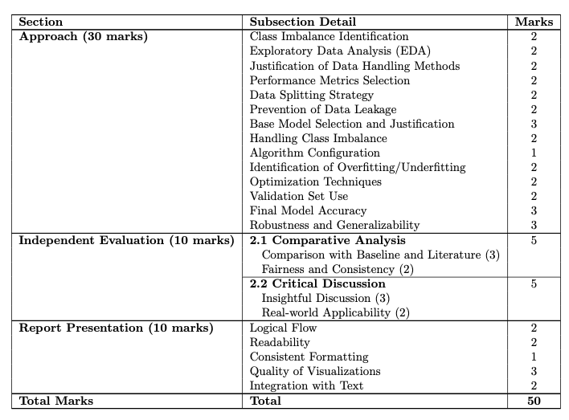
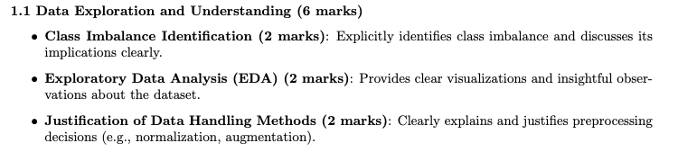
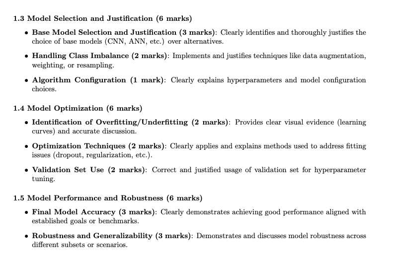
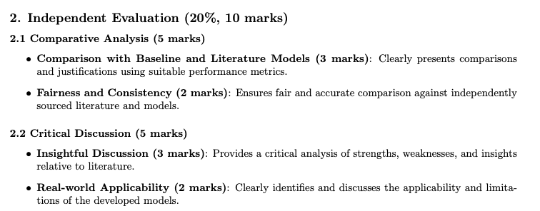
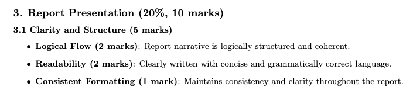
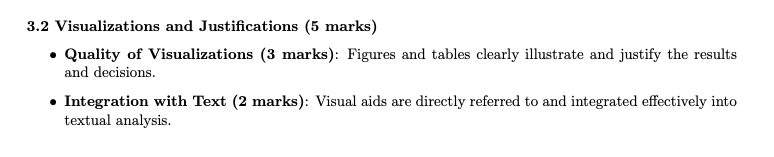

# Assignment 2

> [!NOTE]
> Uses content from week 1-9 (inclusive)

## Hard requirements

- < 2000 words
- < 1000 words in appendix
	- Appendix may only be:
		- Citations
		- Research (excl. things from week 9)
		- Result tables as a means of evidence
- Add names and student IDs to the report
- Use bold heading for each topic

## Tasks (for colon cancer option)

1. Detail an approach to justify each of the systems you wish to implement. This includes linking evidence and rationale
	1. Approach should include: how you're going to evaluate it, how you're going to run EDA and pre processing, selection of baseline models, Hyper-parameter setting
	2. Make 4 models. 2 per student, and 1 per classification task: `isCancerous` and `cell-type`. One model with post processing label is unacceptable
		1. These should be **different types** of algorithms to maximise ML diversity
		2. Must fully train the algorithm
	3. Explore how the data in `data_labels_extraData.csv` can improve the cell-type classification model and use it accordingly in your approach
2. Investigate different ML solutions
	1. Must fully train the algorithms you use
3. Make a judgement will all previously explored information and ML solutions
4. Evaluate selected option
	1. Criteria is up to the student to select. For higher grades you must use techniques that goes beyond simple performance metric analysis
	2. You can use data completely out of scope if you want. Like just download another dataset and run that. Or compare our work to literature?
	3. Your final report must conduct an analysis and comparison between classifying the two categories.

### Criterion Breakdown

---

---

